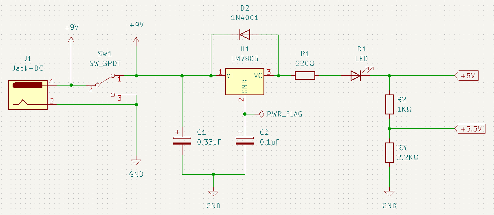
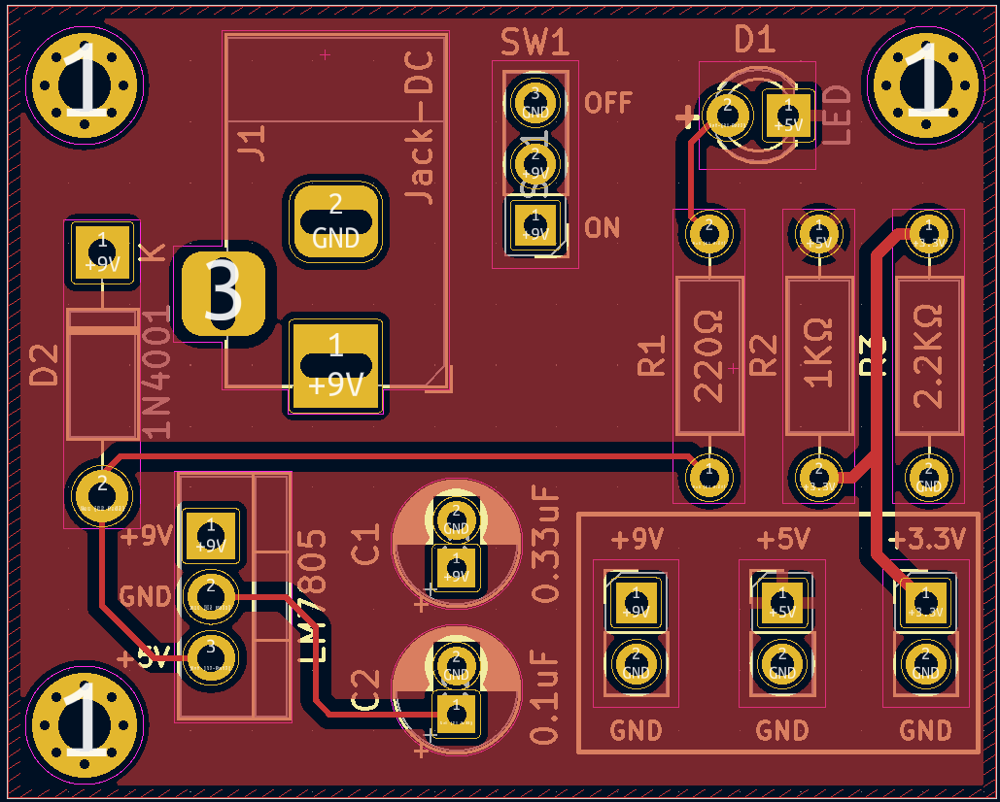
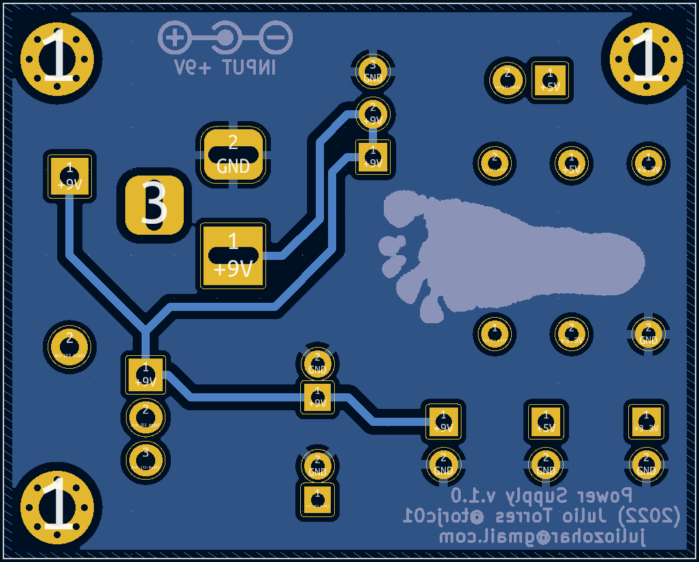
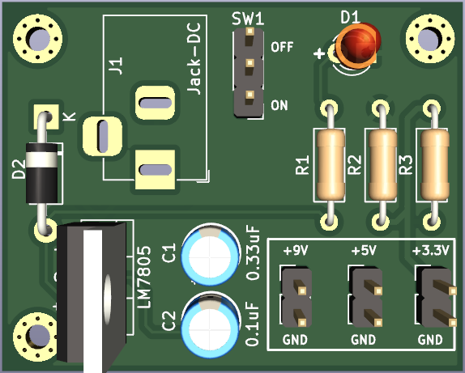
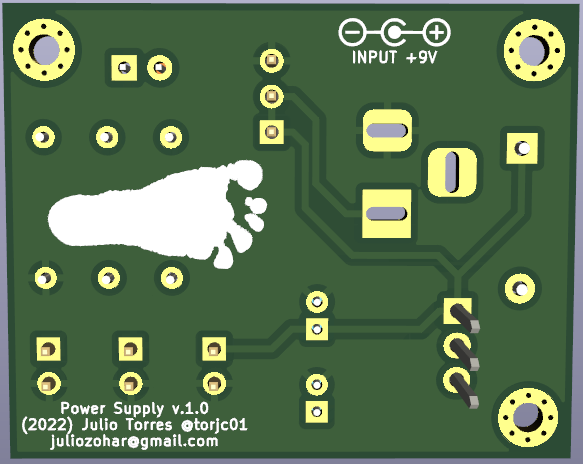

# Power Suppy for microcontrollers v.1.0

Fonte de alimentação para projetos de microcontroladores. A entrada de corrente se dá via adaptador de 9 a 12 V

**Caracteristicas**

Vin: 9V-12V  
Vout: +5V

Tensões disponíveis:
- +9V em AREF
- +5V diretamente de Vout 
- +3.3V via un divisor de tensão aplicado à linha de +5V

Conector de entrada: barrel jack 2.5mm, polaridade positiva ao centro

Switch on/off 

Proteção contra sobrecarga e corrente reversa 

## Schematics 

## Board

### Projeto 
Frente 

Verso  

### Versão do fabricante 

Frente 

Verso 

### Visão 3D

Frente 

Verso

## Referências

### Datasheets

 LM7805 
 
 https://www.ti.com/general/docs/suppproductinfo.tsp?distId=10&gotoUrl=https%3A%2F%2Fwww.ti.com%2Flit%2Fgpn%2Flm340