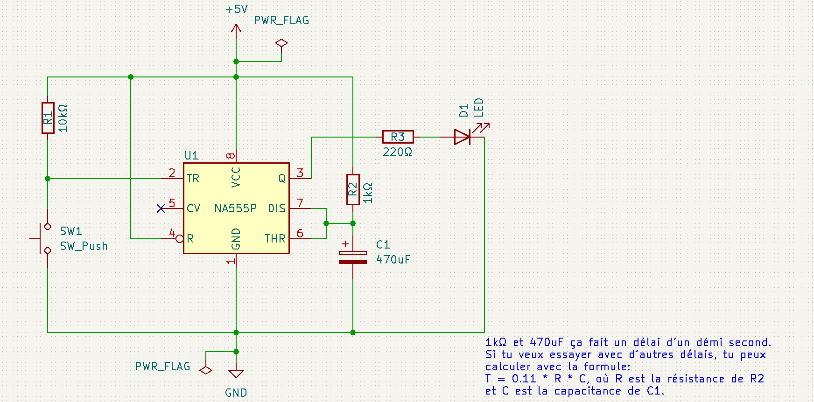

# Timer off

Sub-circuito baseado no CI NE555 cujo objetivo é desligar um circuito principal, apos decorrido um tempo pré-determinado pela combinçao dos valores de uma dupla de capacitor e resistor. 

## Reasoning

O timer é ativado pelo envio de corrente ao pin 2 (trigger) do NE555, que começa a encher o capacitor com carga, até 2/3 da capacidade; durante este periodo, o pin 3 (output) é ativado com a voltagem de saida. 

O delay para a desativaçao do circuito é determinado pela combinaçao de valores do resistor e do capacitor conectaos aos pins 6 e 7. Para um capacitor de valor fixo, digamos 470uF, ao se variar os valores dos resistores, obtemos a variaçao do tempo de delay de desligamento do circuito. Eu experimentei com alguns valores, e os resultados estao na tabela abaixo: 

| Resistor | Capacitor | Tempo de delay | 
|----------|-----------|----------------|
|33kΩ|470uF|15 seg|
|68kΩ|470uF|30 seg|
|122kΩ|470uF|1 min|
|320kΩ|470uF|2:30 min|
|580kΩ|470uF|5 min|
|800kΩ|470uF|7:30 min|
|1060kΩ|470uF|10 min|

Para o calculo dos valores, utilize a formula seguinte: 

```
T = 1.1 * R * C
```


## Schema 



## Referências 

NE555 https://www.ti.com/lit/ds/symlink/ne555.pdf
