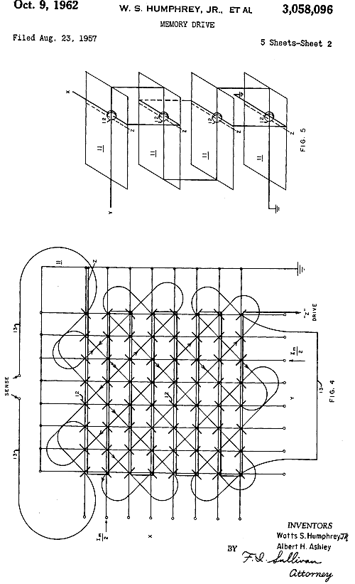

# CircuitosEletronicos
Repositorio de projetos de circuitos eletronicos e de design blocks, nos CADS Eagle e Kicad6.

    

# Projetos

## Arduminimum

Implementação mínima do Arduino, que possa ser reutilizada em projetos de necessitem realizar uma montagem permanente e/ou reduzir o tamanho do seu footprint final. 

## Dawg-B-Gone

Uma implementação do famoso circuito "espanta-cachorros". Este circuito na prática é um circuito que gera ultrasons, além do espectro audível por humanos, mas que para certos animais, em certas faixas de frequências, é repulsivo. Morcegos, ratos; moscas, mosquitos, e pernilongos; gambás, esquilos, enfim, toda sorte de de animal indesejável tem potencialmente uma faixa de frequência que funcionará como repelente. 

PS: A "denominação" do circuito é puramente tradicional, não queremos espantar os nossos amigos cachorros, portanto ficaremos fora da faixa de frequência a que eles são sensíveis. :laughing:

## Power Supply 

Implementação de um bloco de alimentação que seja capaz de receber um range de voltagens na entrada, e em seguida regular e distribuir outras voltagens na saída, que são comumente utilizadas em projetos com microcoltroladoras, como Arduino. O bloco de alimentação é usado como um `design block` para ser reutilizado em outros projetos de micro-eletrônica que necessitem trabalhar com diferentes voltagens. 

## Timer-Off

Prova de conceito da utilização de um CI 555 como switch para desligar um circuito, para auxiliar um colega do `Atelier La Patente` em um de seus projetos. 
