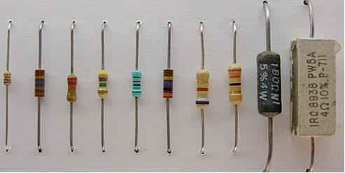
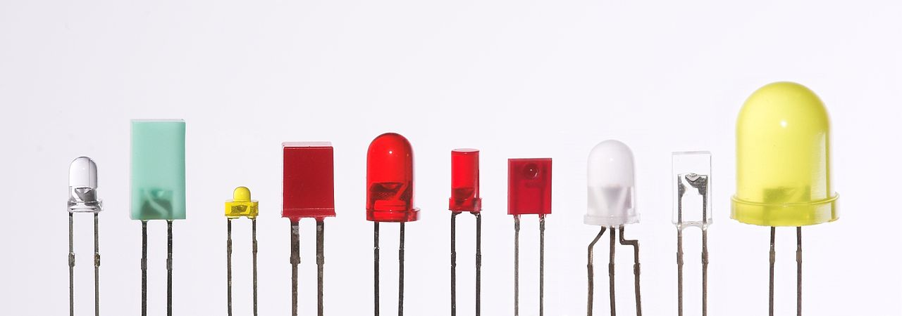
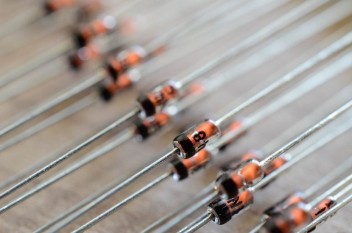
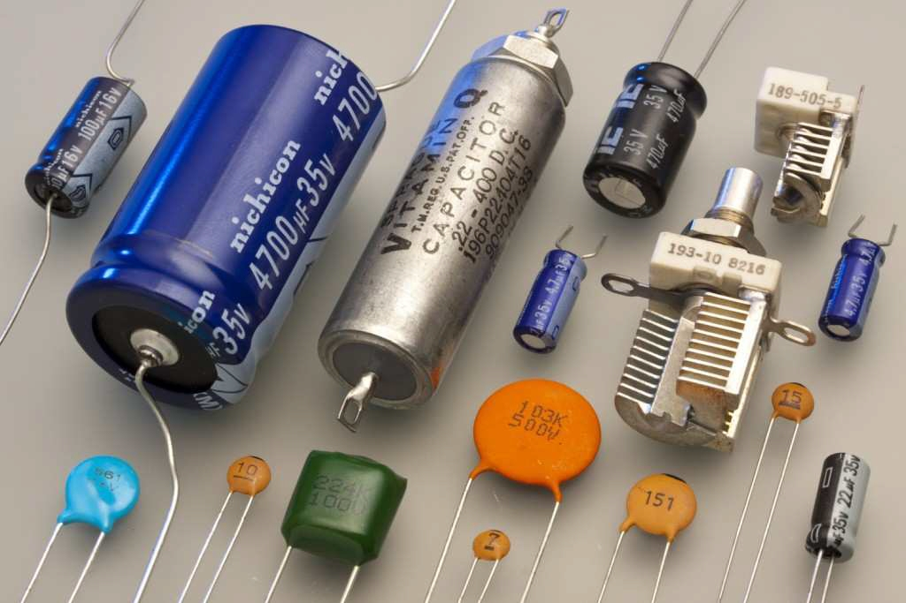

# Especificacoes 

## Unidades de medida 

|Grandeza |Simbolo|Uni|Simbolo da Unidade|
|---------|-------|---|------------------|
|Voltagem |V|volt|V|
|Corrente|I|ampère|A|
|Carga|Q|Coulomb|C|
|Resistência|R|ohm|Ω|
|Capacitância|c|Farad|F|
|Inductância|L|henry|H|
|Reactância|X|ohm|Ω|
|Impedância|Z|ohm|Ω|
|Força|P|watt|W|
|Energia|E|Joule|J|
|Tempo|t|segundo|s|
|Frequência|f|hertz|hz|

## Resistores 

**Valores tipicos de resistores** 

E6 values (20% tolerancia)  
1.0, 1.5, 2.2, 3.3, 4.7, 6.8

## Leds 

**Valores ideais de resistores para LED em série**

|Vin   | Red/Yellow | Blue/Green |
|------|------------|------------|
|5V-6V | >= 180Ω    | >=100Ω     |
|9V    | >=390Ω     | >=330Ω     |
|12V   | >=560Ω     | >=470Ω     |

**Refs**

https://en.wikipedia.org/wiki/E_series_of_preferred_numbers#E6

## Diodos 

*Rectifier diodes*

|Label | Amperage | Voltage | 
|------|----------|---------|
|1N4001|1A        | 50V     |
|1N4004|1A        | 400V    |
|1N4007|1A        | 1000V   |
|RL207 |2A        | 1000V   |
|1N5404|3A        | 400V    |
|1N5406|3A        | 600V    |
|1N5408|3A        | 1000V   |

*Switching diode*

|Label | Amperage | Voltage | 
|------|----------|---------|
|1N4148|200mA     | 100V    |

*Fast recovery diode* 

|Label | Amperage | Voltage | 
|------|----------|---------|
|UF4007|1A        | 1000V   |
|FR107 |1A        | 1000V   |
|FR207 |2A        | 1000V   |

*Schottky diode*

|Label | Amperage | Voltage | 
|------|----------|---------|
|1N5817|1A        | 20V     |
|1N5819|1A        | 40V     |
|1N5822|3A        | 40V     |

## Capacitores

## Tabelas de Capacitores 

### Equivalências 

|microfarads (uF)| |nanoFarads (nF)| |picoFarads (pF)|
|----------------|-|---------------|-|---------------|
|0,000001 uF     |=|0,001        nF|=|1            pF|
|0,00001  uF     |=|0,01         nF|=|10           pF|
|0,0001   uF     |=|0,1          nF|=|100          pF|
|0,001    uF     |=|1            nF|=|1.000        pF|
|0,01     uF     |=|10           nF|=|10.000       pF|
|0,1      uF     |=|100          nF|=|100.000      pF|
|1        uF     |=|1.000        nF|=|1.000.000    pF|
|10       uF     |=|10.000       nF|=|10.000.000   pF|
|100      uF     |=|100.000      nF|=|100.000.000  pF|

### Códigos de valor

|Codigo|Interpretacao|=| pF         | nF     | uF       |
|------|-------------|-|------------|--------|----------|
|102   |10 + 00      |=| 1.000   pF |1   nF | 0,001 uF  |
|103   |10 + 000     |=| 10.000  pF |10  nF |0,01    uF |
|104   |10 + 0000    |=| 100.000 pF |100 nF |0,1     uF |
|222   |22 + 00      |=| 2.200   pf |2,2 nF |0,0022  uF |
|223   |22 + 000     |=| 22.000  pF |22  nF |0,022   uF |
|224   |22 + 0000    |=| 220.000 pF |220 nF |0,22    uF |
|332   |33 + 00      |=| 3.300   pF |3,3 nF |0,0033  uF |
|333   |33 + 000     |=|33.000   pF |33  nF |0,033   uF |
|334   |33 + 0000    |=|330.000  pF |330 nF |0,33    uF |
|472   |47 + 00      |=|4.700    pF |4,7 nF |0,0047  uF |
|473   |47 + 000     |=|47.000   pF |47  nF |0,047   uF |
|502   |50 + 00      |=|5.000    pF |5   nF |0,0005  uF |
|503   |50 + 000     |=|50.000   pF |50  nF |0,005   uF |
|504   |50 + 0000    |=|500.000  pF |500 nF |0,05    uF |

### Label e valores

|Label|Value |
|-----|------|
|100  |10  pF|
|101  |100 pF|
|151  |150 pF|
|221  |220 pF|
|331  |330 pF|
|471  |470 pF|
|681  |680 pF|
|102  |1   nF|
|152  |1.5 nF|
|222  |2.2 nF|
|332  |3.3 nF|
|472  |4.7 nF|
|682  |6.8 nF|
|103  |10  nF|
|153  |15  nF|
|223  |22  nF|
|473  |47  nF|
|683  |68  nF|
|104  |100 nF|
|104  |0.1 uF|
|154  |0.15uF|
|224  |0.22uF|
|334  |0.33uF|
|474  |0.47uF|
|684  |0.68uF|
|105  |1   uF|
|225  |2.2 uF|
|475  |4.5 uF|
|106  |10  uF|
|200  |20  pF|
|300  |30  pF|
|470  |47  pF|
|680  |68  pF|

## Semicondutores 

### Packages 

